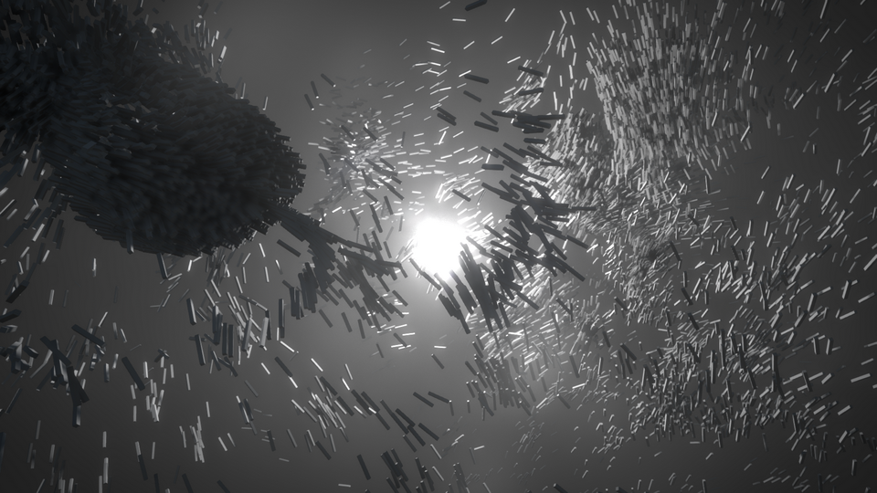

# VL.Boids-GPU
GPU Boids Simulation implemented in [vvvv gamma](https://visualprogramming.net).

## Installing 

To use the latest stable version:
1. Go to Gamma's Quad menu > Manage Nugets > Commandline and type:  
`nuget install VL.Boids-GPU`
2. Press Enter and wait the ending of the installation process
3. Open the Help Menu (F1). Open the tap "Learn". Search for the pack "Boids"

Original from: [Indie Visual Lab](https://github.com/IndieVisualLab/UnityGraphicsProgrammingSeries)
